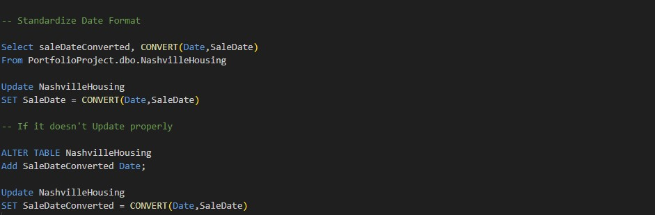
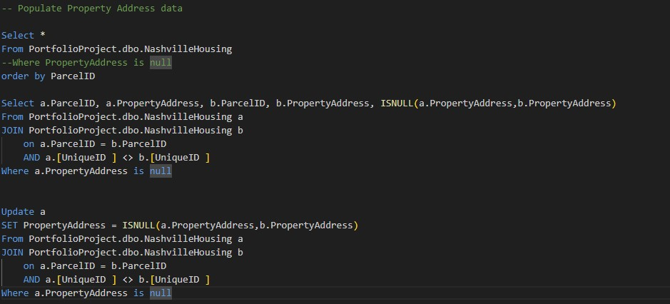
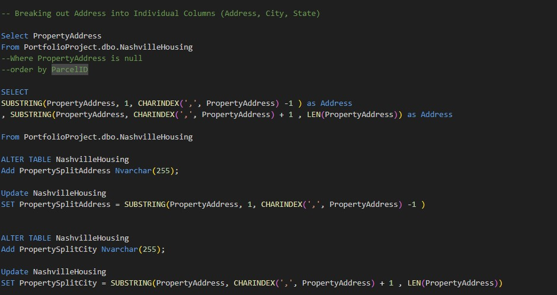
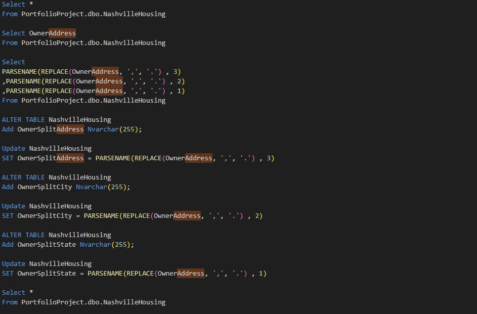
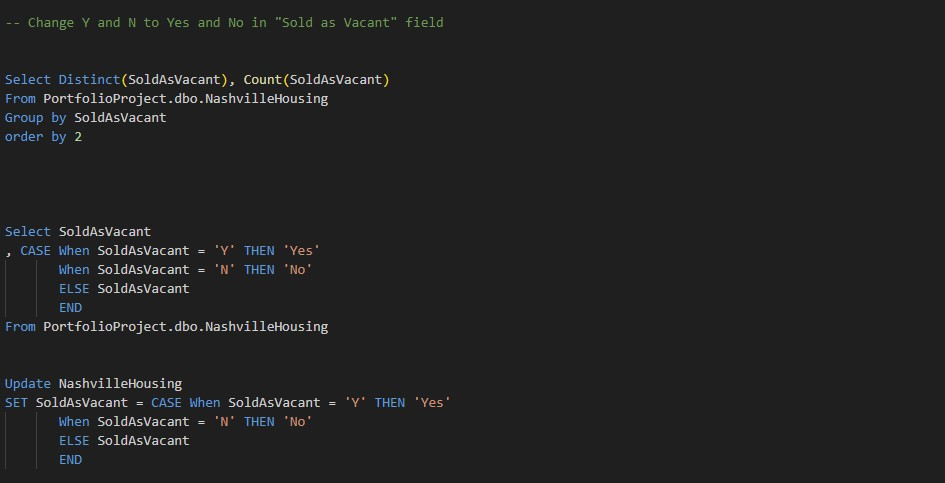

# Nashville Housing Data for Data Cleaning SQL

Welcome to the SQL Data Cleaning Practice - Nashville Housing project! This project focuses on cleaning, formulating, and structuring the Nashville Housing Data File.

## Introduction

The provided code demonstrates data cleaning tasks performed on the NashvilleHousing table in the PortfolioProject database. Each section addresses a specific data-cleaning operation and includes SQL queries to achieve the desired transformations. Here's a brief explanation of each section:

## Project Highlights:
- **1. Standardize Date Format**
  - The code converts the SaleDate column to a standardized date format by selecting and updating the SaleDate column using the CONVERT function.

- **2. Populate Property Address data**
  - This section populates missing PropertyAddress values by joining the NashvilleHousing table with itself based on the ParcelID. The ISNULL function is used to prioritize non-null values from the joined rows and update the missing PropertyAddress values accordingly.

- **3. Populate Property Address data**
  - This section populates missing PropertyAddress values by joining the NashvilleHousing table with itself based on the ParcelID. The ISNULL function is used to prioritize non-null values from the joined rows and update the missing PropertyAddress values accordingly.

- **4. Populate Property Address data**
  - This section populates missing PropertyAddress values by joining the NashvilleHousing table with itself based on the ParcelID. The ISNULL function is used to prioritize non-null values from the joined rows and update the missing PropertyAddress values accordingly.

- **5. Populate Property Address data**
  - This section populates missing PropertyAddress values by joining the NashvilleHousing table with itself based on the ParcelID. The ISNULL function is used to prioritize non-null values from the joined rows and update the missing PropertyAddress values accordingly.

The provided SQL queries showcase the process of cleaning and transforming data within the NashvilleHousing table, ensuring better data quality and usability for further analysis.
